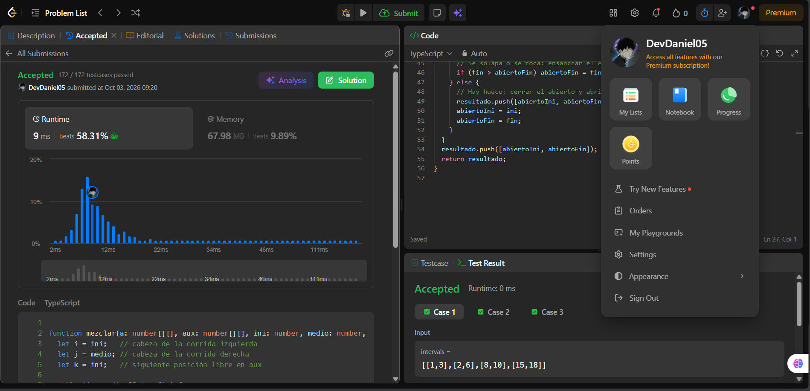
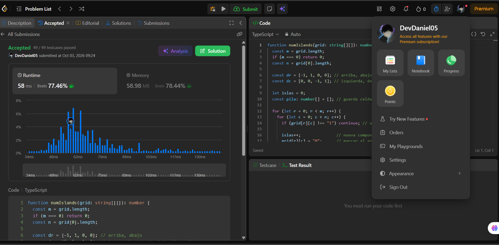
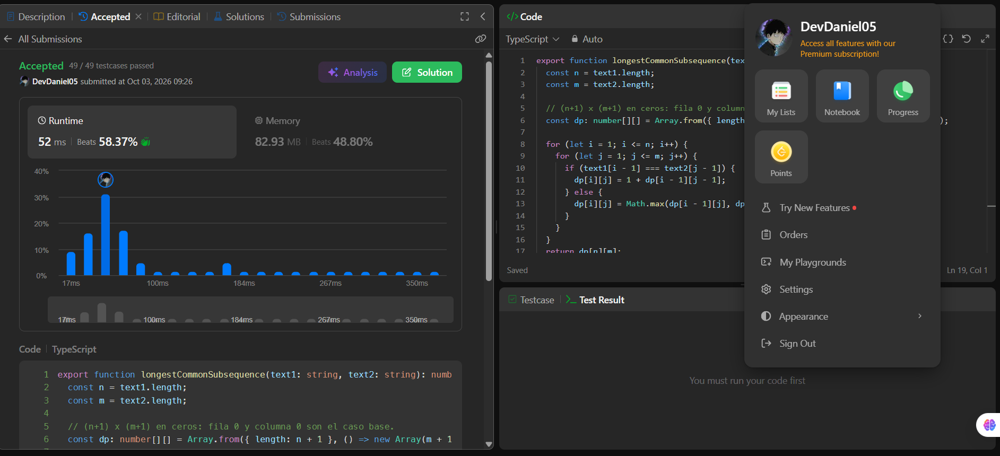
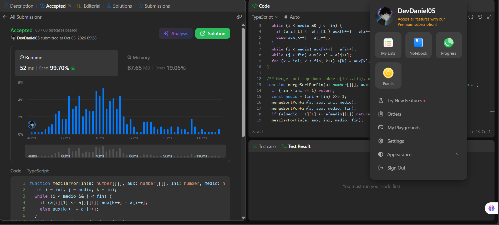
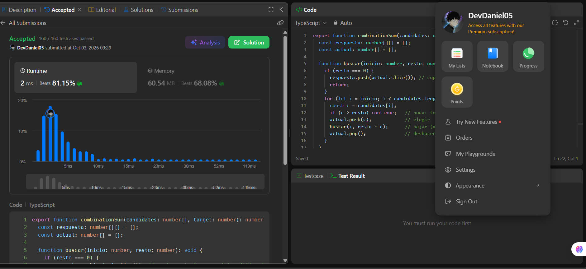

# Taller · Cinco familias en LeetCode

**Curso:** Análisis de algoritmos · ITM · 2026-2

| # | Problema | Familia | Tiempo | Espacio |
|---|---|---|---|---|
| 1 | [56. Merge Intervals](https://leetcode.com/problems/merge-intervals/) | Ordenamiento | O(n log n) | O(n) |
| 2 | [200. Number of Islands](https://leetcode.com/problems/number-of-islands/) | Grafos | Θ(m·n) | O(m·n) |
| 3 | [1143. Longest Common Subsequence](https://leetcode.com/problems/longest-common-subsequence/) | Programación dinámica | Θ(n·m) | Θ(n·m) |
| 4 | [435. Non-overlapping Intervals](https://leetcode.com/problems/non-overlapping-intervals/) | Greedy | O(n log n) | O(n) |
| 5 | [39. Combination Sum](https://leetcode.com/problems/combination-sum/) | Backtracking | O(n^(t/min + 1)) | O(t/min) + salida |

---

## 56. Merge Intervals

Código: [`merge-intervals.ts`](merge-intervals/merge-intervals.ts)

**Familia:** ordenamiento  
**Idea:** la clave es `start`. Se ordenan los **intervalos completos** con merge sort
propio (dividir a la mitad, ordenar cada mitad y `mezclar` dos corridas ordenadas, como
el `merge` del laboratorio de despacho). Después, una pasada mantiene el intervalo
«abierto»: si el siguiente empieza en `s <= fin` (se solapa o se toca) se ensancha
`fin = max(fin, e)`; si no, se cierra el abierto y se abre otro.  
**Complejidad** (`n` = número de intervalos): tiempo **O(n log n)**, porque el merge sort
cumple `T(n) = 2T(n/2) + O(n)`; la pasada es O(n). Espacio **O(n)**: buffer auxiliar +
copia + salida; la pila de recursión es O(log n).

---

## 200. Number of Islands

Código: [`number-of-islands.ts`](number-of-islands/number-of-islands.ts)

**Familia:** grafos  
**Modelo:** cada celda `'1'` es un **vértice**; hay **arista no dirigida** entre dos `'1'`
vecinos arriba/abajo/izquierda/derecha (la diagonal **no** cuenta). Las celdas `'0'` no son vértices.  
**Idea:** contar islas = contar **componentes conexas**. Se recorren las celdas; cada `'1'`
no visitado suma 1 y lanza un **DFS con pila explícita** que «hunde» toda la isla
(la marca como `'0'`). La pila explícita evita el límite de recursión en grillas de 300×300.  
**Complejidad** (`m` filas, `n` columnas): tiempo **Θ(m·n)**, porque cada celda entra a la pila
a lo sumo una vez y mira 4 vecinas. Espacio **O(m·n)** en el peor caso (la pila, si todo es tierra).

---

## 1143. Longest Common Subsequence

Código: [`longestCommonSubsequence.ts`](longest-common-subsequence/longestCommonSubsequence.ts) 
**Familia:** programación dinámica  
**Estado:** `dp[i][j]` = longitud de la LCS de los prefijos `text1[0..i)` y `text2[0..j)`.  
**Base:** `dp[0][j] = dp[i][0] = 0` (un prefijo vacío).  
**Recurrencia:**

- si `text1[i-1] == text2[j-1]` → `dp[i][j] = 1 + dp[i-1][j-1]` (la letra entra en la LCS);
- si no → `dp[i][j] = max(dp[i-1][j], dp[i][j-1])` (se descarta la letra de una de las dos).

**Respuesta:** `dp[n][m]`.  
**Complejidad** (`n = |text1|`, `m = |text2|`): tiempo **Θ(n·m)** (una celda por par de
prefijos, O(1) cada una). Espacio **Θ(n·m)** (la tabla); se podría bajar a Θ(min(n, m))
guardando solo dos filas.

---

## 435. Non-overlapping Intervals

Código: [`eraseOverlapIntervals.ts`](non-overlapping-intervals/eraseOverlapIntervals.ts)

**Familia:** greedy (selección de actividades)  
**Criterio greedy:** ordenar por **`end`** (merge sort propio) y, de izquierda a derecha,
**quedarse con el intervalo que termina antes** entre los que no pisan al último aceptado,
es decir, aceptar `[s, e]` si `s >= ultimoFin`. Terminar antes deja más espacio libre para el resto.
Tocar en un extremo (`[1,2]` y `[2,3]`) **no** es solapar.  
**Respuesta:** lo que no se eligió es lo que se borra: `n − aceptados`.  
**Complejidad** (`n` = número de intervalos): tiempo **O(n log n)**, dominado por el merge sort;
la pasada greedy es O(n). Espacio **O(n)** (copia + buffer auxiliar del merge sort).

---

## 39. Combination Sum

Código: [`combination-sum.ts`](combination-sum/combination-sum.ts)

**Familia:** backtracking  
**Estado de la búsqueda:** `(inicio, resto, actual)`.

- **Se elige** `candidates[i]` con `i >= inicio`, se agrega a `actual` y se baja con el **mismo `i`**
  (se puede reutilizar). Como nunca se vuelve a índices menores, `[2,2,3]` aparece una sola vez y nunca `[2,3,2]`.
- **Éxito:** si `resto == 0`, se copia `actual` a la respuesta.
- **Poda:** si `candidates[i] > resto`, esa rama se pasaría de `target` y no se explora.
- **Se deshace:** al regresar se hace `pop()` del último elegido (el *backtrack*) y se prueba el siguiente `i`.

**Complejidad** (`n = |candidates|`, `t = target`, `min` = menor candidato): el árbol tiene
profundidad máxima `t/min` y hasta `n` ramas por nivel, así que el tiempo es **O(n^(t/min + 1))**
en el peor caso (exponencial). Espacio **O(t/min)** para la pila de recursión y la combinación
actual, más el tamaño de la salida.

